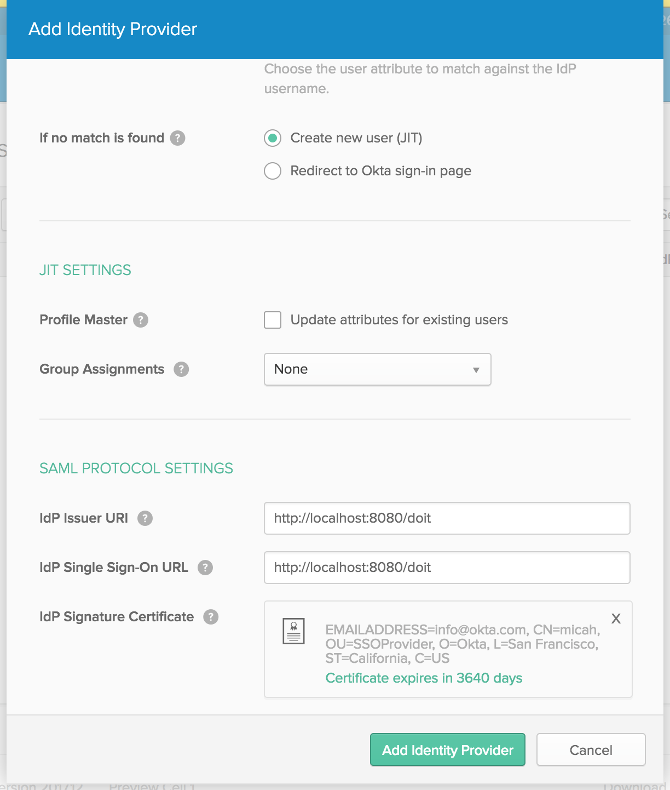

# Spring Boot, Spring Security & Okta with Custom Login Screen

This example takes advantage of Spring Security's OAuth2 capabilities in conjunction with Okta's 
[OIDC](https://en.wikipedia.org/wiki/OpenID_Connect) Application service along with a custom Login screen.

Why is this necessary? 

Ordinarily, when you are authenticating to an external provider, there's an expectation that you 
will see that provider's login screen. For instance, when you log in with Facebook, there's an expectation that you will
have a Facebook branded login experience.

However, there are times when you want to hide the fact that an external provider is doing the heavy lifting of
authentication. For instance, while you are using Okta as an external provider, you might want to "white label" the
login experience so that it has the look and feel of your website.

Most of what's done in this example is handled automatically by Spring Security, there's some Okta configuration that's
required, including a "workaround" to ensure that Okta will redirect to *your* custom login page when an unauthenticated
user tries to access a protected endpoint.

This README assumes that you've already registered an [Okta developer account](https://developer.okta.com)

Follow these steps to setup your Okta tenant. Then, you can deploy this example locally, to your own cloud environment,
or to Heroku (Click [here](#deploy-to-heroku) to jump ahead to deploy to Heroku.)

1. Create an Authorization Server
    1. Navigate to Security -> API -> Authorization Servers
    2. Click `Add Authorization Server`
    
        
        
    3. Next, choose `Access Policies` and click on `Add Policy`
    
        
        
    4.  Give the policy a name and description and leave `All clients` selected
    
        
        
    5. Click the `Add Rule` button
    
        
        
    6. Give it a name and leave all the defaults selected. This will allow anyone assigned to the Application in the steps below access to the secured pages of your application.
    
        
        
    7. Navigate to the `Settings` tab of your Authorization Server. Make note of the `Metadata URI`. You'll use it later.
        
        
        
2. Create an API Token
    1. Navigate to Security -> API -> Tokens
    2. Click `Create Token`
    
        
        
    3. Make note of the token value. You'll use it later.
    
        
        
3. Now, we'll add some trusted origins
    1. Navigate to Security -> API -> Trusted Origins
    2. Click `Add Origin`
    
        

4. Next, we'll setup the OIDC Application
    1. Navigate to Applications
    2. Click `Add Application`. Select `OpenID Connect`
   
        
       
    3. Give it a name and click `Next`
   
        
       
    4. Click the `Add URI` button in the `Redirect URIs` section of the page
   
        
       
    5. Add redirect uris for `/`, `/login`, `/doit` and `/secure`
   
        
        
    6. On the same page, make note of the `Client ID` and the `Client secret`. You'll use it later.
        
5. The final Okta configuration step is the workaround. If someone is *not* logged in, and they hit a protected endpoint (such as `/secure`), we want to ensure that they are redirected to your custom login page.
    1. Navigate to Security -> Identity Providers
    2. Click the `Add Identity Provider` button. Choose `Add SAML 2.0 IdP`. 
    
        
        
    3. Fill in the `IdP Issuer URI` and `IdP Single Sign-on URL` with the URL to *your* custom login page (like: `http://localhost:8080/doit`)
    
        
        
        Note: You'll need to upload a valid cert, although for our purposes, it doesn't matter how it was generated.
        
    4. Click the gear icon next to `Add Identity Provider`. Choose the identity provider you just created as the default.
    
        
        
        IMPORTANT NOTE: This will make it so that when you try to navigate to your Okta tenant, it will redirect to the login
        page you just entered. To workaround this behavior, you can browse directly to your tenant to manage it as in:
        `https://<your tenant id>.oktapreview.com/login/default`
       
# Environment Variables

At a minimum, you need to set the following environment variables or settings in `application.yml`
(environment variables are recommended so as to not put sensitive information in a repo)

Note: Most of the variables can be found by following the metadata URI you saved earlier

| Env Variable                                         | Yaml property                               |
|------------------------------------------------------|---------------------------------------------|
| OKTA_API_URL                                         | okta.api.url                                |
| OKTA_API_TOKEN                                       | okta.api.token                              |
| OKTA_REDIRECT_URI                                    | okta.redirect.uri                           |
| SECURITY_OAUTH2_CLIENT_CLIENTID                      | security.oauth2.client.clientId             |
| SECURITY_OAUTH2_CLIENT_CLIENT_SECRET                 | security.oauth2.client.clientSecret         |
| SECURITY_OAUTH2_CLIENT_ACCESS_TOKEN_URI              | security.oauth2.client.accessTokenUri       |
| SECURITY_OAUTH2_CLIENT_USER_AUTHORIZATION_URI        | security.oauth2.client.userAuthorizationUri |
| SECURITY_OAUTH2_CLIENT_CLIENT_AUTHENTICATION_SCHEME  | security.oauth2.client.authenticationScheme |
| SECURITY_OAUTH2_CLIENT_SCOPE                         | security.oauth2.client.scope                |
| SECURITY_OAUTH2_RESOURCE_USER_INFO_URI               | security.oauth2.resource.userInfoUri        |
| SECURITY_OAUTH2_RESOURCE_PREFER_TOKEN_INFO           | security.oauth2.resource.preferTokenInfo    |

# Deploy to Heroku

